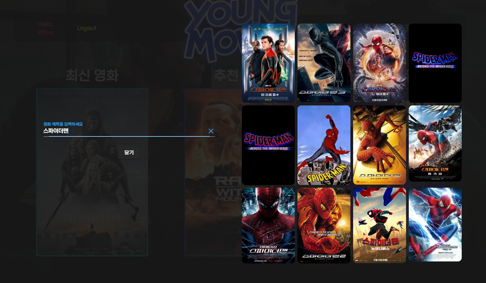

# YOUNG MOVIES

## :computer: 목표 서비스

사용자가 보고 싶은 영화의 장르, 개봉시기, 런타임, 관람객 평점을 기반으로 개인화 추천 서비스를 제공합니다. 이외에도 최신 영화 및 서비스 사용자들이 감명 깊게 본 영화들을 추천받을 수 있습니다. 사용자들은 자유게시판을 활용하여 영화와 관련된 다양한 정보들을 교류할 수 있습니다.

## :man_technologist: Team
**김현영**

- BackEnd
  1. Movie 모델링
  2. Movie Serializer
- FrontEnd
  1. 영화 검색 기능 & 페이지
  2. 영화 추천 기능 & 페이지
  3. 메인 페이지 디자인 및 Carousel
  4. Login & Signup

**김영훈**

* BackEnd
  1. review 모델링
  2. comment 모델링
  3. review, comment Serializer 등 백엔드 전반

* FrontEnd
  1. 영화 상세 페이지
  2. 자유 게시판(review) 페이지
  3. 게시글(review) 상세 페이지
  4. 게시글 생성, 수정 페이지
  5. 유저 프로필 페이지

## :bulb: 목표 기능

- 영화 추천
- 영화 검색
- 영화 정보 조회
  - 영화 제목
  - 개봉일
  - 장르
  - 런타임
  - TMDB 평점
  - 영무비 평점
  - 줄거리
- 자유 게시판 기능
- 게시글 작성, 수정, 삭제, 조회, `좋아요`
- 게시글에 댓글 작성, 수정, 삭제
- 회원 가입
- 프로필 조회
  - 아이디
  - 작성한 게시글
  - `좋아요`를 누른 게시글

## :floppy_disk: ERD

1. `User`와 `Review`, `ReviewComment`, `MovieScore`는 1:N 관계를 갖는다. `User`는 각 모델의 작성자로써 이용된다.
2. `Review`와 `ReviewComment`는 1:N 관계를 갖는다.
3. `Collection`과 `CollectionCommen`는 1:N 관계를 갖는다.
4. `User`와 `Movie`, `Review`는 M:N 관계를 갖는다. `User`는 `좋아요` 표시를 한 `like_users`로써 이용된다.

## :open_file_folder: 개발 도구

- Python
  - Python 3
  - Django 3.2.12
  - Django REST framework 3.13.1
- HTML, CSS
  - Bootstrap 5
  - Animate CSS 4.1.1
- Javascript
  - ECMA6 +
- Vue 2
  - Vuex
  - Vue Router
  - Vuetify 2
- Database
  - sqlite3

## :calling: 서비스

## :video_camera: **영화**

### 메인페이지

- 메인 페이지는 세 개의 Carousel로 구성된다.
  - 왼쪽 Carousel은 TMDB에서 제공하는 최신 영화들 중 흥행 중인 영화가 선택된다.
  - 중간 Carousel은 사용자가 추천 서비스를 이용한 결과를 추후에 다시 확인할 수 있도록 보여준다.
  - 오른쪽 Carousel은 서비스 사용자들이 직접 평가한 영화들 중 평점 상위 10개의 영화를 보여준다.
- 반응형 웹 형태로 구성함으로써, 좁은 화면에서도 페이지를 효율적으로 이용할 수 있도록 하였다.

### **추천**

- TMDB에서 제공하는 영화 정보들 중 사용자의 취향에 맞는 영화를 찾을 수 있도록 4개의 파라미터를 제공한다. 
  - 장르는 여러 개를 선택 가능하며, 해당 장르를 모두 가지고 있는 영화가 검색된다.
  - 개봉 연도는 두 개의 기준점을 정해서, 그 사이 개봉년도를 가진 영화들만 검색된다.
  - 상영 시간도 개봉 연도와 마찬가지로 두 개의 기준 시간을 선택할 수 있다.
  - 평점 하한선은 TMDB 평점을 기준으로, 그 이상의 평점을 가진 영화들이 검색된다.

### **추천 영화**

* 사진과 같이 8개의 영화가 추천된다.
* 추천되는 순간 브라우저에 저장되며, 메인 페이지의 Carousel과 뒤로 가기를 통해 다시 확인할 수 있다.

### **영화 검색 기능**

* 사용자는 TMDB에 존재하는 모든 영화를 기반으로 원하는 영화를 검색할 수 있다. 검색 결과는 사용자의 입력 값에 따라 실시간으로 출력되며 결과를 누를 경우 해당 영화의 상세 페이지로 이동한다.
* 반응형 웹 구조를 사용하여, 좁은 화면에서도 효율적으로 영화를 검색할 수 있다.

## :page_facing_up: 자유 게시판

사용자들이 영화와 관련하여 자유롭게 소통할 수 있는 자유 게시판 기능

* 댓글수, 좋아요, 작성일을 기준으로 정렬하여 조회할 수 있다.
* 검색 기능을 통해 원하는 게시글을 검색하여 조회할 수 있다.
* 게시글을 클릭하면 해당 게시글의 상세 페이지로 이동한다.

### **게시글**

* 로그인한 사용자는 게시글을 작성, 수정, 삭제할 수 있다.
* 게시글에 대해 `좋아요`를 누를 수 있으며, 해당 게시글에 대한 총 `좋아요` 수를 나타낸다.
* 댓글 조회, 작성, 수정, 삭제가 가능하다.

- 게시글 작성자, 댓글 작성자의 아이디를 클릭하면 해당 사용자의 프로필 페이지로 이동한다.

- 목록 버튼을 클릭하면 자유게시판으로 이동한다.

  

## :bust_in_silhouette: **사용자**

### 회원가입

### 로그인

### 프로필 페이지

* 사용자는 개인 프로필 페이지가 존재하며 프로필에서 사용자가 작성한 게시글, `좋아요`를 누른 게시글들을 확인할 수 있다.

## :thinking: 느낀 점

### 현영

* 생각보다 모델링을 갈아엎는 일이 많지는 않았는데, 시리얼라이저 등 백엔드 부분을 다루어 본 지 오래되어 많이 해멨다.
* 뷰에서 데이터 흐름이 중요하다는 말이 왜 나왔는지 깨달았다. 데이터를 다룰 때 타입 에러 등의 오류와, life cycle hook에 따라 페이지에 렌더링 되는 순서 때문에 발생하는 오류가 매우 빈번했다.
* 외부에서 코드를 가져올 때 이해를 완전히 하지 못했기 때문에 기존의 코드와 꼬이는 부분이 생겼다.
* 조금 더 다양한 기능을 구현해 보지 못한 부분이 아쉽다. 시간이 좀 더 있었다면...

### :cat: 영훈

* 프로젝트 시작이 정말 중요하단 걸 느꼈다. 어떤 서비스를 만들 것인지, 그에 따라 어떤 모델이 필요할 것인지 등 꽤 구체적으로 계획을 하고 프로젝트를 진행하는 게 효율적이라는 점을 배웠다.
* 프론트엔드를 다루며 디자인 역량도 꽤 중요하다는 걸 느꼈다. 같은 기능이라도 어떤 디자인인지에 따라 더 좋아보이고 사용하고 싶게끔 만든다는 걸 느꼈다. 다양한 레이아웃과 디자인들을 찾아보며 감을 익히는 것도 필요할 것 같다.
* vue 사용이 아직 익숙치 않아 고전했다. vue life cycle hook에 대한 이해를 높이기 위해 더 공부해야 겠다고 생각했다. 그리고 자바스크립트 문법 또한 한참 다루며 익혀야 겠다고 생각했다. 단순한 for 문, if 문 인데도 바로바로 떠오르지 않았다.
* 협업 과정에서 소통이 상당히 중요하다는 점. git으로 버전관리를 할 때 작업 전, 후로 상대방과 긴밀히 소통하며 작업을 해야 충돌 issue가 발생하지 않고 원활하게 프로젝트가 진행될 수 있을 것 같다.
