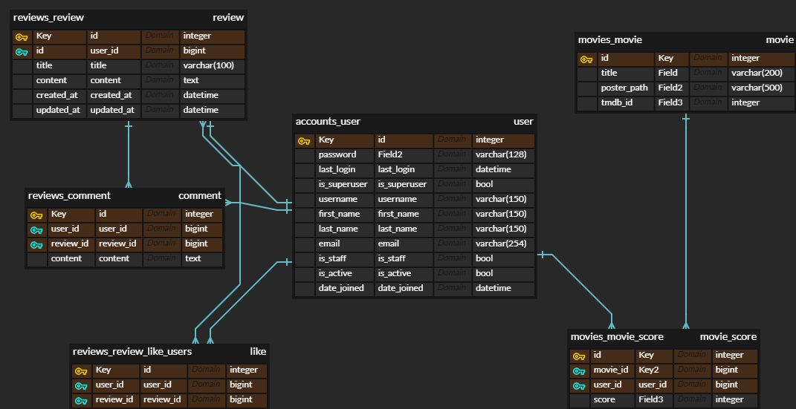

# YOUNG MOVIES

## YOUNG MOVIES

본 프로젝트는 

## Team Sort

**김현영**

**김영훈**

* BackEnd
  1. review 모델링
  2. comment 모델링
  3. review, comment 관련 백엔드 전반

* FrontEnd
  1. 영화 상세 페이지
  2. 자유 게시판(review) 페이지
  3. 게시글(review) 상세 페이지
  4. 게시글 생성, 수정 페이지
  5. 유저 프로필 페이지

## 목표 서비스

사용자가 보고 싶은 영화의 장르, 개봉시기, 런타임, 관람객 평점을 기반으로 개인화 추천 서비스를 제공합니다. 이외에도 최신 영화 및 서비스 사용자들이 감명 깊게 본 영화들을 추천받을 수 있습니다. 사용자들은 자유게시판을 활용하여 영화와 관련된 다양한 정보들을 교류할 수 있습니다.

## 목표 기능

- 영화 추천
- 영화 검색
- 영화 정보 조회
  - 영화 제목
  - 개봉일
  - 장르
  - 런타임
  - TMDB 평점
  - 영무비 평점
  - 줄거리
- 자유 게시판 기능
- 게시글 작성, 수정, 삭제, 조회, `좋아요`
- 게시글에 댓글 작성, 수정, 삭제
- 회원 가입
- 프로필 조회
  - 아이디
  - 작성한 게시글
  - `좋아요`를 누른 게시글

## ERD

1. `User`와 `Review`, `ReviewComment`, `MovieScore`는 1:N 관계를 갖는다. `User`는 각 모델의 작성자로써 이용된다.
2. `Review`와 `ReviewComment`는 1:N 관계를 갖는다.
3. `Collection`과 `CollectionCommen`는 1:N 관계를 갖는다.
4. `User`와 `Movie`, `Review`는 M:N 관계를 갖는다. `User`는 `좋아요` 표시를 한 `like_users`로써 이용된다.

## 개발 도구

- Python
  - Python 3
  - Django 3.2.12
  - Django REST framework 3.13.1
- HTML, CSS
  - Bootstrap 5
  - Animate CSS 4.1.1
- Javascript
  - ECMA6 +
  - Vue 3
  - Vuetify 2
- Database
  - sqlite3

## 기능

## **영화**

### **추천**

사용자가 좋아하거나 평가한 영화를 기반으로 선호 장르를 알아내고 이를 기반으로 영화를 추천한다. 또한 사용자는 `B영화` 또는 `힙스터` 기능을 활성화해 추천받는 영화의 종류를 달리 할 수 있다. `B영화`를 선택한 사용자는 B급영화를, `힙스터`를 선택한 사용자는 비교적 유명하지 않은 영화를 추천받을 수 있다. 사용자가 `좋아요`를 누르거나 후기를 남긴 영화는 추천되지 않는다.

- 사진

  

사용자는 선호하는 장르 4개에 대하여 영화를 추천받을 수 있다.

- 사진

  

사용자가 로그인시 장고에서 사용자 정보를 이용해 영화 추천 query를 작성한다. 이를 Vue로 전달하여 axios를 이용해 API 요청을 보내고 응답받은 추천 영화 목록을 화면에 출력한다. 영화를 추천받고 해당 영화의 모든 데이터를 받아와 전체 페이지가 렌더링될 때까지 사용자가 기다리는 일이 없도록 CSR을 적극 활용하였다.

사용자에게 추천된 영화중 일반 추천은 6개, 장르 추천은 3개의 영화가 노출된다. 사용자는 우측의 `새로고침` 버튼을 눌러 추천받은 영화를 랜덤으로 다시 불러올 수 있다.

### **조회**

ㅎㅇ

몰라

* 사용자는 TMDB에서 제공하는 모든 영화에 대하여 TMDB에서 제공하는 제목, 포스터, 개봉일, TMDB 평점, 장르, 줄거리 등을 조회할 수 있다.

* 사용자는 영화에 대해 10점 만점의 평점을 매길 수 있다. 이 평점은 서비스 사용자들의 평점과 합산되어 TMDB 평점과 별개로 본 서비스 이용자들만의 평점을 이룬다.

영화 조회시 후기 작성과 다른 사용자의 후기 조회가 가능하다. 다른 사용자의 후기는 최신순과 인기순으로 정렬할 수 있다. 하단에는 TMDB에서 제공하는 함께 보면 좋은 영화와 비슷한 영화가 함께 보여진다.

### 신규 가입자 **영화 선호도 조사**

사용자가 가입한 이후 로그인을 하면 엄선한 영화 목록을 출력하고 그중 좋아하는 영화를 선택하도록 한다. 이는 이후 사용자 맞춤 추천을 위한 초기 데이터가 된다. 이때 어떤 사용자는 몇 가지 영화만 선택하고, 어떤 사용자가 더 정확한 추천을 받기 위해 많은 영화를 선택할 수 있기 때문에 무한 스크롤을 구현해 필요할 때마다 새로운 영화를 계속 갱신받을 수 있도록 하였다.

- 사진

  

### **영화 검색 기능**

사용자는 TMDB에 존재하는 모든 영화를 기반으로 원하는 영화를 검색할 수 있다. 검색 결과는 사용자의 입력 값에 따라 실시간으로 출력되며 결과를 누를 경우 해당 영화의 상세 페이지로 이동한다.

- 사진

  

## **커뮤니티**

### **후기**

로그인한 사용자는 영화에 대한 후기를 작성, 수정, 삭제할 수 있다. 후기는 상세 페이지가 존재하여 `좋아요`를 누를 수 있으며 댓글 조회, 작성, 수정, 삭제가 가능하다.

- 사진

  

최신 후기와 한 주의 인기 후기는 메인 페이지에 게시된다.

- 사진

  

### **컬렉션**

B급 영화는 그 인기를 평가내리기 위한 기준이 상대적으로 불분명하기 때문에 사용자가 직접 추천을 할 수 있는 기능이 큰 역할을 하리라 기대했다. 이를 위해 사용자가 직접 영화를 묶어 추천을 할 수 있도록 컬렉션 기능을 추가하였다.

사용자는 TMDB에서 제공하는 모든 영화를 이용해 자신만의 컬렉션을 만들 수 있다. 모든 컬렉션은 컬렉션 페이지에서 조회 가능하며 최신순과 인기순으로 정렬 가능하다.

- 사진

최신 컬렉션과 한 주의 인기 컬렉션은 메인 페이지에 게시된다.

- 사진

컬렉션은 각 상세 페이지가 존재하며 댓글을 남기고 `좋아요`를 누를 수 있다. 컬렉션에서 영화를 선택하면 해당 영화 상세 페이지로 이동한다.

- 사진

## **사용자**

사용자는 회원가입시 다른 사용자와 중복되지 않는 닉네임을 입력해야 한다.

사용자는 개인 페이지가 존재하며 개인 페이지에서 `B영화`와 `힙스터` 모드 활성화, 닉네임 수정, 비밀번호 수정, 로그아웃을 할 수 있으며 각 사용자가 생성한 컬렉션, `좋아요`를 누른 컬렉션, 평가한 영화, 좋아한 영화, 후기, `좋아요`를 누른 후기를 확인할 수 있다.