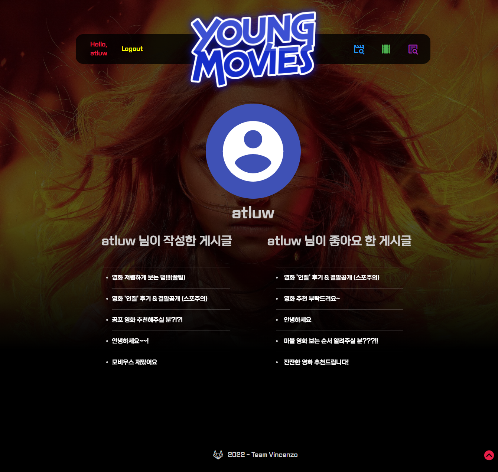

# YOUNG MOVIES

## 목표 서비스

사용자가 보고 싶은 영화의 장르, 개봉시기, 런타임, 관람객 평점을 기반으로 개인화 추천 서비스를 제공합니다. 이외에도 최신 영화 및 서비스 사용자들이 감명 깊게 본 영화들을 추천받을 수 있습니다. 사용자들은 자유게시판을 활용하여 영화와 관련된 다양한 정보들을 교류할 수 있습니다.

## Team Sort

**김현영**

**김영훈**

* BackEnd
  1. review 모델링
  2. comment 모델링
  3. review, comment 관련 백엔드 전반

* FrontEnd
  1. 영화 상세 페이지
  2. 자유 게시판(review) 페이지
  3. 게시글(review) 상세 페이지
  4. 게시글 생성, 수정 페이지
  5. 유저 프로필 페이지

## 목표 기능

- 영화 추천
- 영화 검색
- 영화 정보 조회
  - 영화 제목
  - 개봉일
  - 장르
  - 런타임
  - TMDB 평점
  - 영무비 평점
  - 줄거리
- 자유 게시판 기능
- 게시글 작성, 수정, 삭제, 조회, `좋아요`
- 게시글에 댓글 작성, 수정, 삭제
- 회원 가입
- 프로필 조회
  - 아이디
  - 작성한 게시글
  - `좋아요`를 누른 게시글

## ERD

1. `User`와 `Review`, `ReviewComment`, `MovieScore`는 1:N 관계를 갖는다. `User`는 각 모델의 작성자로써 이용된다.
2. `Review`와 `ReviewComment`는 1:N 관계를 갖는다.
3. `Collection`과 `CollectionCommen`는 1:N 관계를 갖는다.
4. `User`와 `Movie`, `Review`는 M:N 관계를 갖는다. `User`는 `좋아요` 표시를 한 `like_users`로써 이용된다.

## 개발 도구

- Python
  - Python 3
  - Django 3.2.12
  - Django REST framework 3.13.1
- HTML, CSS
  - Bootstrap 5
  - Animate CSS 4.1.1
- Javascript
  - ECMA6 +
  - Vue 3
  - Vuetify 2
- Database
  - sqlite3

## 기능

## **영화**

### **추천**

사용자가 좋아하거나 평가한 영화를 기반으로 선호 장르를 알아내고 이를 기반으로 영화를 추천한다. 또한 사용자는 `B영화` 또는 `힙스터` 기능을 활성화해 추천받는 영화의 종류를 달리 할 수 있다. `B영화`를 선택한 사용자는 B급영화를, `힙스터`를 선택한 사용자는 비교적 유명하지 않은 영화를 추천받을 수 있다. 사용자가 `좋아요`를 누르거나 후기를 남긴 영화는 추천되지 않는다.

- 사진

  

사용자는 선호하는 장르 4개에 대하여 영화를 추천받을 수 있다.

- 사진

  

사용자가 로그인시 장고에서 사용자 정보를 이용해 영화 추천 query를 작성한다. 이를 Vue로 전달하여 axios를 이용해 API 요청을 보내고 응답받은 추천 영화 목록을 화면에 출력한다. 영화를 추천받고 해당 영화의 모든 데이터를 받아와 전체 페이지가 렌더링될 때까지 사용자가 기다리는 일이 없도록 CSR을 적극 활용하였다.

사용자에게 추천된 영화중 일반 추천은 6개, 장르 추천은 3개의 영화가 노출된다. 사용자는 우측의 `새로고침` 버튼을 눌러 추천받은 영화를 랜덤으로 다시 불러올 수 있다.

### **조회**

* 사진

* 사용자는 TMDB에서 제공하는 모든 영화에 대하여 TMDB에서 제공하는 제목, 포스터, 개봉일, TMDB 평점, 장르, 줄거리 등을 조회할 수 있다.

* 사용자는 영화에 대해 10점 만점의 평점을 매길 수 있다. 이 평점은 서비스 사용자들의 평점과 합산되어 TMDB 평점과 별개로 본 서비스 이용자들만의 평점을 이룬다.

### **영화 검색 기능**

* 사용자는 TMDB에 존재하는 모든 영화를 기반으로 원하는 영화를 검색할 수 있다. 검색 결과는 사용자의 입력 값에 따라 실시간으로 출력되며 결과를 누를 경우 해당 영화의 상세 페이지로 이동한다.

## 자유 게시판

사용자들이 영화와 관련하여 자유롭게 소통할 수 있는 자유 게시판 기능

* 댓글수, 좋아요, 작성일을 기준으로 정렬하여 조회할 수 있다.
* 검색 기능을 통해 원하는 게시글을 검색하여 조회할 수 있다.
* 게시글을 클릭하면 해당 게시글의 상세 페이지로 이동한다.

### **게시글**

* 로그인한 사용자는 게시글을 작성, 수정, 삭제할 수 있다.
* 게시글에 대해 `좋아요`를 누를 수 있으며, 해당 게시글에 대한 총 `좋아요` 수를 나타낸다.
* 댓글 조회, 작성, 수정, 삭제가 가능하다.

- 게시글 작성자, 댓글 작성자의 아이디를 클릭하면 해당 사용자의 프로필 페이지로 이동한다.

- 목록 버튼을 클릭하면 자유게시판으로 이동한다.

  

## **사용자**

### 회원가입

### 로그인

### 프로필 페이지

* 사용자는 개인 프로필 페이지가 존재하며 프로필에서 사용자가 작성한 게시글, `좋아요`를 누른 게시글들을 확인할 수 있다.